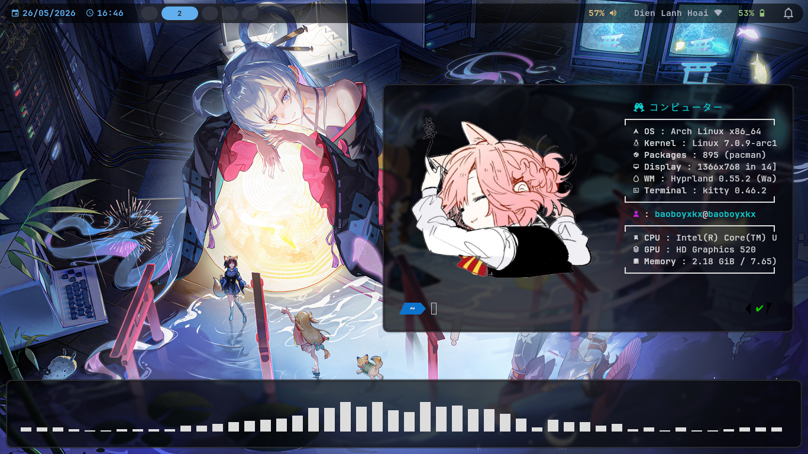

# my first rice
# note
- i didn't make this for everyone, just for my and some of my friends(i have no friends at all) 
- you won't get the image for fastfetch when git clone, maybe choose one yourself or add logo :). i'll leave the link to wallpaper at the end. thanks
- i still have a lot of stuff to do, but don't really know.
## everything ok now 
- save it here so if i miss arch when i change to void, i can go back(i'm too lazy to change tho) 
## System info
- distro: Archlinux
- WM: hyprland
- bar: waybar
- terminal: kitty
- shell: zsh
- launcher: rofi
- font: jetbrainsmono nerd font (remember to download the right font)
- use this for font i guess
- sudo pacman -S ttf-jetbrains-mono-nerd
## How to download (remember to get git before)
### clone it
- use this command at ~
- git clone https://github.com/bbyxkx/my-dotfiles.git
### copy to your .config/ 
- cp ~/dotfiles/hypr ~/.config/
- cp ~/dotfiles/waybar ~/.config/
- cp ~/dotfiles/kitty ~/.config/
- cp ~/dotfiles/rofi ~/.config/
- cp ~/dotfiles/fastfetch ~/.config/
#### then restart hyprland or reboot 
### wallpaper here
- https://wallhaven.cc/w/pow9ym
- download and use swww or hyprpaper
# screenshot

